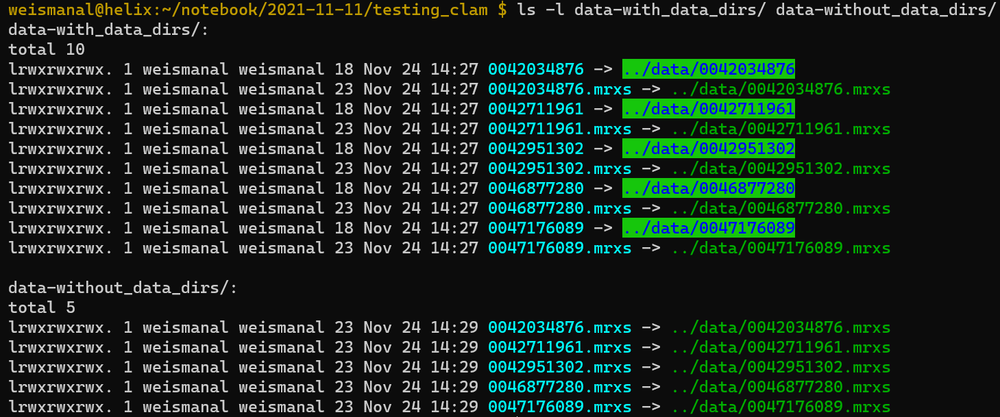
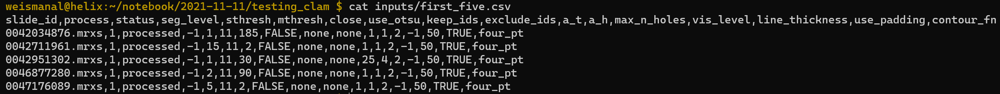
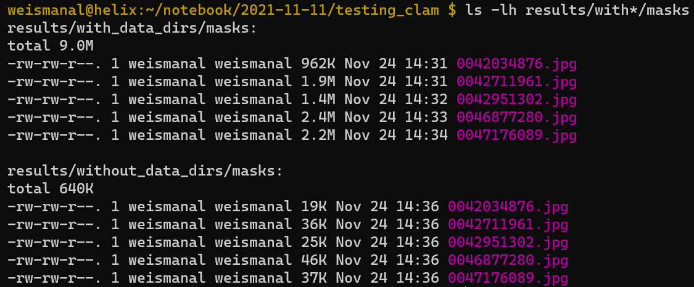
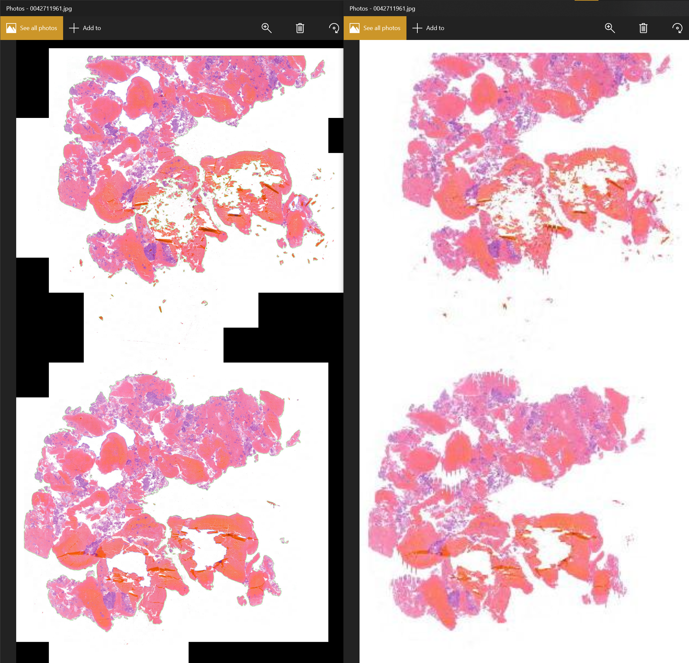

# Question for Pinyi regarding CLAM processing of `.mrxs` files

I believe the question was whether CLAM could process `.mrxs` files or if they needed to be first converted to `.ome.tif`. I *thought* I had got it working on `.mrxs` files but I'd like to run it by you to make sure I'm not missing any symptoms of CLAM not actually working. You said it didn't work for you, which is why you first converted the `.mrxs` files to `ome.tif` and then ran CLAM on these files.

You suggested to run the algorithm on the `.mrxs` files with and without their corresponding data directories to see if there was any difference, which sounded to me like a smart thing to try. I created these directories using symbolic links:



Then I created a process list file called `first_five.csv` containing the first five images in your processing list, except I used the `.mrxs` file extensions instead of `.ome.tif`:



Then I ran

```bash
python $CLAM/create_patches_fp.py --source $working_dir/data-with_data_dirs --save_dir $working_dir/results/with_data_dirs --patch_size 256 --process_list $working_dir/inputs/first_five.csv --seg --patch --stitch
```

and got [this output](../logs/preprocessing-with_data_dirs.log), a sample of which is here:

```
source:  /home/weismanal/notebook/2021-11-11/testing_clam/data-with_data_dirs
patch_save_dir:  /home/weismanal/notebook/2021-11-11/testing_clam/results/with_data_dirs/patches
mask_save_dir:  /home/weismanal/notebook/2021-11-11/testing_clam/results/with_data_dirs/masks
stitch_save_dir:  /home/weismanal/notebook/2021-11-11/testing_clam/results/with_data_dirs/stitches
source : /home/weismanal/notebook/2021-11-11/testing_clam/data-with_data_dirs
save_dir : /home/weismanal/notebook/2021-11-11/testing_clam/results/with_data_dirs
patch_save_dir : /home/weismanal/notebook/2021-11-11/testing_clam/results/with_data_dirs/patches
mask_save_dir : /home/weismanal/notebook/2021-11-11/testing_clam/results/with_data_dirs/masks
stitch_save_dir : /home/weismanal/notebook/2021-11-11/testing_clam/results/with_data_dirs/stitches
{'seg_params': {'seg_level': -1, 'sthresh': 8, 'mthresh': 7, 'close': 4, 'use_otsu': False, 'keep_ids': 'none', 'exclude_ids': 'none'}, 'filter_params': {'a_t': 100, 'a_h': 16, 'max_n_holes': 8}, 'patch_params': {'use_padding': True, 'contour_fn': 'four_pt'}, 'vis_params': {'vis_level': -1, 'line_thickness': 250}}


progress: 0.00, 0/5
processing 0042034876.mrxs
Creating patches for:  0042034876 ...
Total number of contours to process:  2
Bounding Box: 305216 172544 73665 89537
Contour Area: 3736807424.0
Extracted 57531 coordinates
Bounding Box: 274432 45056 73985 90945
Contour Area: 3911882752.0
Extracted 57388 coordinates
start stitching 0042034876
original size: 410368 x 438784
downscaled size for stiching: 6412 x 6856
number of patches: 114919
patch size: 256x256 patch level: 0
ref patch size: (256, 256)x(256, 256)
downscaled patch size: 4x4
progress: 0/114919 stitched
progress: 11492/114919 stitched
progress: 22984/114919 stitched
progress: 34476/114919 stitched
progress: 45968/114919 stitched
progress: 57460/114919 stitched
progress: 68952/114919 stitched
progress: 80444/114919 stitched
progress: 91936/114919 stitched
progress: 103428/114919 stitched
segmentation took 2.40860652923584 seconds
patching took 5.037021636962891 seconds
stitching took 11.895476341247559 seconds


progress: 0.20, 1/5
processing 0042711961.mrxs
Creating patches for:  0042711961 ...
Total number of contours to process:  73
Bounding Box: 120960 289600 4673 4801
Contour Area: 14907392.0
Extracted 256 coordinates
Bounding Box: 90880 269696 1153 577

[[SNIP]]

Contour Area: 6981632.0
Extracted 124 coordinates
Bounding Box: 265088 59008 2177 2497
Contour Area: 3428352.0
Extracted 65 coordinates
start stitching 0047176089
original size: 410368 x 438784
downscaled size for stiching: 6412 x 6856
number of patches: 226329
patch size: 256x256 patch level: 0
ref patch size: (256, 256)x(256, 256)
downscaled patch size: 4x4
progress: 0/226329 stitched
progress: 22633/226329 stitched
progress: 45266/226329 stitched
progress: 67899/226329 stitched
progress: 90532/226329 stitched
progress: 113165/226329 stitched
progress: 135798/226329 stitched
progress: 158431/226329 stitched
progress: 181064/226329 stitched
progress: 203697/226329 stitched
segmentation took 1.5016601085662842 seconds
patching took 46.46311545372009 seconds
stitching took 24.33589792251587 seconds
average segmentation time in s per slide: 1.7651687622070313
average patching time in s per slide: 22.088859367370606
average stiching time in s per slide: 25.433882999420167
```


Then I ran (different `--source` and `--save_dir` arguments)

```bash
python $CLAM/create_patches_fp.py --source $working_dir/data-without_data_dirs --save_dir $working_dir/results/without_data_dirs --patch_size 256 --process_list $working_dir/inputs/first_five.csv --seg --patch --stitch
```

and got this output:

```
source:  /home/weismanal/notebook/2021-11-11/testing_clam/data-without_data_dirs
patch_save_dir:  /home/weismanal/notebook/2021-11-11/testing_clam/results/without_data_dirs/patches
mask_save_dir:  /home/weismanal/notebook/2021-11-11/testing_clam/results/without_data_dirs/masks
stitch_save_dir:  /home/weismanal/notebook/2021-11-11/testing_clam/results/without_data_dirs/stitches
source : /home/weismanal/notebook/2021-11-11/testing_clam/data-without_data_dirs
save_dir : /home/weismanal/notebook/2021-11-11/testing_clam/results/without_data_dirs
patch_save_dir : /home/weismanal/notebook/2021-11-11/testing_clam/results/without_data_dirs/patches
mask_save_dir : /home/weismanal/notebook/2021-11-11/testing_clam/results/without_data_dirs/masks
stitch_save_dir : /home/weismanal/notebook/2021-11-11/testing_clam/results/without_data_dirs/stitches
{'seg_params': {'seg_level': -1, 'sthresh': 8, 'mthresh': 7, 'close': 4, 'use_otsu': False, 'keep_ids': 'none', 'exclude_ids': 'none'}, 'filter_params': {'a_t': 100, 'a_h': 16, 'max_n_holes': 8}, 'patch_params': {'use_padding': True, 'contour_fn': 'four_pt'}, 'vis_params': {'vis_level': -1, 'line_thickness': 250}}


progress: 0.00, 0/5
processing 0042034876.mrxs
Creating patches for:  0042034876 ...
Total number of contours to process:  0
segmentation took 0.12459993362426758 seconds
patching took 5.0067901611328125e-05 seconds
stitching took -1 seconds


progress: 0.20, 1/5
processing 0042711961.mrxs
Creating patches for:  0042711961 ...
Total number of contours to process:  0
segmentation took 0.06915450096130371 seconds
patching took 3.790855407714844e-05 seconds
stitching took -1 seconds


progress: 0.40, 2/5
processing 0042951302.mrxs
Creating patches for:  0042951302 ...
Total number of contours to process:  0
segmentation took 0.06893348693847656 seconds
patching took 4.267692565917969e-05 seconds
stitching took -1 seconds


progress: 0.60, 3/5
processing 0046877280.mrxs
Creating patches for:  0046877280 ...
Total number of contours to process:  0
segmentation took 0.07157468795776367 seconds
patching took 3.933906555175781e-05 seconds
stitching took -1 seconds


progress: 0.80, 4/5
processing 0047176089.mrxs
Creating patches for:  0047176089 ...
Total number of contours to process:  0
segmentation took 0.06633520126342773 seconds
patching took 4.00543212890625e-05 seconds
stitching took -1 seconds
average segmentation time in s per slide: 0.08011956214904785
average patching time in s per slide: 4.200935363769531e-05
average stiching time in s per slide: -1.0
```

The former job (the one with the data directories) contains things in the `masks`, `patches`, and `stiches` directories, whereas the latter job (the one without the data directories) only contains things in the `masks` directory. The file sizes of the resulting JPGs are different:



The latter images do indeed look like downsampled, smaller versions of the former images. E.g.:



**Question:** Perhaps those were the thumbtails you were referring to on our call? Does it look to you like CLAM is working on the `.mrxs` files now? Are there any other red flags? It's certainly possible my own installation of OpenSlide fixed the problem you were seeing. I just want to make sure I'm not missing the problem you were seeing!

Thanks so much Pinyi.
